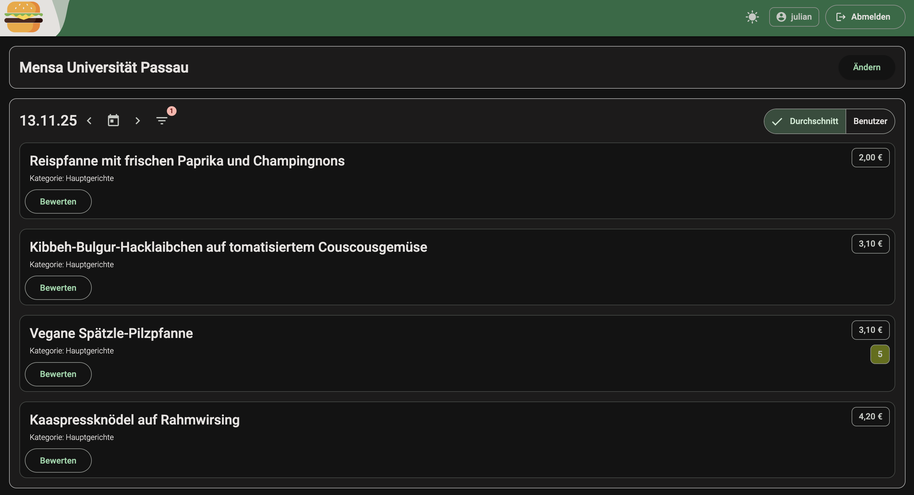

# MensaRater
A simple web app to rate dishes at school/university mensas and cafetarias in Germany/Austria.

The current release is deployed at [mensarater.web.app](https://mensarater.web.app)

## History
The MensaRater app originated from an idea I had together with some fellow students where we were joking about creating a database to keep track of dishes at the mensa that we liked or did not like, first just for the sake of having a statistic and second not to get something again that didn't meet our taste. Another struggle that I faced was that it was quite tedious to look up the menu for today as I would have to log in to Stud.IP everytime (which is especially annoying since the Stud.IP app is only available for Android) or dig through the STWNO website (maybe a bookmark would have helped there).

Some time passed and on a boring weekend, after having worked with the STWNO api in a software testing lecture, I started to build a very simple single page web app that just showed a table with the menu of the mensa of the University of Passau (where I was studying) for the current day where you could submit a rating for every dish so that if in the future, a dish with the exact same name is again on the menu, I would be able to see what rating it got back then. I also made it a progressive web app so I just could save it as an "app" on my phone to be able to quickly look up what's on the menu today. So basically, both of my struggles were solved.

I then continued to work on the app as a hobby project and kept adding new features to make it more usable (e.g. introducing user accounts, other mensas beside Passau) and also visually more appealing.

## Features
- Display the menu of a day for a selected mensa/cafeteria, including the price of a dish
- Navigate through days
- Rate dishes on a scale from 0 to 10, including an explicit warning flag
- Filter for dish categories
- Switch between selected mensas/cafeterias

## Supported Mensas/Cafeterias
Currently, the app provides support for the following mensas/cafeterias:
- Mensa University of Passau
- Mensa TH Deggendorf
- Mensa Würzburg Campus Hubland Süd/Nord

If there is the interest of adding a new specific mensa, please contact me.

## Data Source
The datasource for the menu data used in the app is the [OpenMensa](https://openmensa.org) project which provides a very convenient REST api for the majority of mensas/cafeterias in Germany and other European countries.
